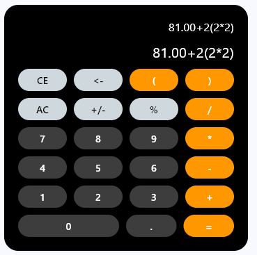

# Mobile Computing

## Calculator

This is a simple calculator that can perform basic arithmetic operations. It is written in Python and Flet.

### Project Structure

```
├───Mobile_Computing
    ├───ButtonEvents.py
    ├───Calculator.py
    └───main.py
```

### Description

- The **ButtonEvents.py** file contains the ButtonEvents class which is responsible for handling the button events.
- The **Calculator.p**y file contains the Calculator class which is responsible for performing the arithmetic operations.
- The **main.py** file contains the main code that creates the calculator window.

#### To run the project

```bash
uv flet run
```

Error's to be fixed:

